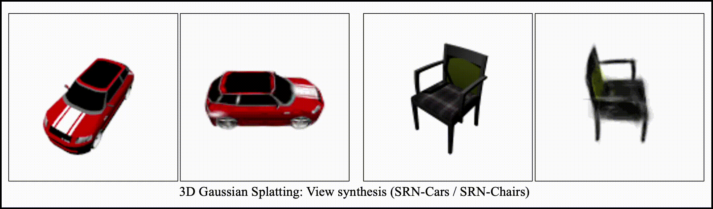

  
# 🔥 PyTorch C++ Samples 🔥
  

## 🚀 Quick Start (Details: <a href="#-requirement-library">Library</a>, <a href="#-preparation-run">Run</a>)
Requirements: `LibTorch`, `OpenCV`, `OpenMP`, `Boost`, `Gnuplot`, `libpng/png++/zlib`  

### 1. Git Clone

~~~
$ git clone https://github.com/koba-jon/pytorch_cpp.git
$ cd pytorch_cpp
$ sudo apt install g++-8
~~~

### 2. Run

**(1) Change Directory** (Model: <a href="Dimensionality_Reduction/AE1d">AE1d</a>)
~~~
$ cd Dimensionality_Reduction/AE1d
~~~

**(2) Build**
~~~
$ mkdir build
$ cd build
$ cmake ..
$ make -j4
$ cd ..
~~~

**(3) Dataset Setting** (Dataset: <a href="https://github.com/koba-jon/normal_distribution_dataset">Normal Distribution Dataset</a>)
~~~
$ cd datasets
$ git clone https://github.com/koba-jon/normal_distribution_dataset.git
$ ln -s normal_distribution_dataset/NormalDistribution ./NormalDistribution
$ cd ..
~~~

**(4) Training**
~~~
$ sh scripts/train.sh
~~~

**(5) Test**
~~~
$ sh scripts/test.sh
~~~

## 🔄 Updates

11/27,2025: Release of `v2.9.1.1`  
11/21,2025: Implementation of `SRGAN`  
11/19,2025: Implementation of `DiT`  
11/14,2025: Release of `v2.9.1`  
11/01,2025: Implementation of `NeRF` and `3DGS`  
10/16,2025: Release of `v2.9.0`  
10/16,2025: Implementation of `PixelSNAIL-Gray` and `PixelSNAIL-RGB`  
10/14,2025: Implementation of `YOLOv8`  
10/13,2025: Implementation of `YOLOv5`  
10/09,2025: Implementation of `RF2d`  

See more...

  
10/08,2025: Implementation of `FM2d`  
10/08,2025: Implementation of `LDM`  
10/04,2025: Implementation of `Glow`  
10/01,2025: Implementation of `Real-NVP2d`  
09/28,2025: Implementation of `Planar-Flow2d` and `Radial-Flow2d`  
09/25,2025: Release of `v2.8.0.2`  
09/22,2025: Implementation of `PixelCNN-Gray` and `PixelCNN-RGB`  
09/18,2025: Implementation of `VQ-VAE-2`  
09/16,2025: Implementation of `VQ-VAE`  
09/14,2025: Implementation of `PNDM2d`  
09/14,2025: Release of `v2.8.0.1`  
09/12,2025: Implementation of `SimCLR`  
09/11,2025: Implementation of `MAE`  
09/10,2025: Implementation of EMA for `DDPM2d` and `DDIM2d`  
09/08,2025: Implementation of `EfficientNet`  
09/07,2025: Implementation of `CycleGAN`  
09/05,2025: Implementation of `ViT`  
09/04,2025: Release of `v2.8.0`  
09/04,2025: Implementation of `DDIM2d`  
09/04,2025: Implementation of `DDPM2d`  
06/27,2023: Release of `v2.0.1`  
06/27,2023: Create the heatmap for Anomaly Detection  
05/07,2023: Release of `v2.0.0`  
03/01,2023: Release of `v1.13.1`  
09/12,2022: Release of `v1.12.1`  
08/04,2022: Release of `v1.12.0`  
03/18,2022: Release of `v1.11.0`  
02/10,2022: Release of `v1.10.2`  
02/09,2022: Implementation of `YOLOv3`  
01/09,2022: Release of `v1.10.1`  
01/09,2022: Fixed execution error in test on CPU package  
11/12,2021: Release of `v1.10.0`  
09/27,2021: Release of `v1.9.1`  
09/27,2021: Support for using different devices between training and test  
09/06,2021: Improved accuracy of time measurement using GPU  
06/19,2021: Release of `v1.9.0`  
03/29,2021: Release of `v1.8.1`  
03/18,2021: Implementation of `Discriminator` from DCGAN  
03/17,2021: Implementation of `AE1d`  
03/16,2021: Release of `v1.8.0`  
03/15,2021: Implementation of `YOLOv2`  
02/11,2021: Implementation of `YOLOv1`  
01/21,2021: Release of `v1.7.1`  
10/30,2020: Release of `v1.7.0`  
10/04,2020: Implementation of `Skip-GANomaly2d`  
10/03,2020: Implementation of `GANomaly2d`  
09/29,2020: Implementation of `EGBAD2d`  
09/28,2020: Implementation of `AnoGAN2d`  
09/27,2020: Implementation of `SegNet`  
09/26,2020: Implementation of `DAE2d`  
09/13,2020: Implementation of `ResNet`  
09/07,2020: Implementation of `VGGNet`  
09/05,2020: Implementation of `AlexNet`  
09/02,2020: Implementation of `WAE2d GAN` and `WAE2d MMD`  
08/30,2020: Release of `v1.6.0`  
06/26,2020: Implementation of `DAGMM2d`  
06/26,2020: Release of `v1.5.1`  
06/26,2020: Implementation of `VAE2d` and `DCGAN`  
06/01,2020: Implementation of `Pix2Pix`  
05/29,2020: Implementation of `U-Net Classification`  
05/26,2020: Implementation of `U-Net Regression`  
04/24,2020: Release of `v1.5.0`  
03/23,2020: Implementation of `AE2d`  
  

## 🏗️ Implementation

### 📊 Multiclass Classification
  
<table>
  <tr>
    <th>Category</th>
    <th>Model</th>
    <th>Paper</th>
    <th>Conference/Journal</th>
    <th>Code</th>
  </tr>
  <tr>
    <td rowspan="5">CNNs</td>
    <td>AlexNet</td>
    <td><a href="http://papers.nips.cc/paper/4824-imagenet-classification-with-deep-convolutional-neural-networ">A. Krizhevsky et al.</a></td>
    <td>NeurIPS 2012</td>
    <td><a href="Multiclass_Classification/AlexNet">AlexNet</a></td>
  </tr>
  <tr>
    <td>VGGNet</td>
    <td><a href="https://arxiv.org/abs/1409.1556">K. Simonyan et al.</a></td>
    <td>ICLR 2015</td>
    <td><a href="Multiclass_Classification/VGGNet">VGGNet</a></td>
  </tr>
  <tr>
    <td>ResNet</td>
    <td><a href="https://openaccess.thecvf.com/content_cvpr_2016/html/He_Deep_Residual_Learning_CVPR_2016_paper.html">K. He et al.</a></td>
    <td>CVPR 2016</td>
    <td><a href="Multiclass_Classification/ResNet">ResNet</a></td>
  </tr>
  <tr>
    <td>Discriminator</td>
    <td><a href="https://arxiv.org/abs/1511.06434">A. Radford et al.</a></td>
    <td>ICLR 2016</td>
    <td><a href="Multiclass_Classification/Discriminator">Discriminator</a></td>
  </tr>
  <tr>
    <td>EfficientNet</td>
    <td><a href="https://proceedings.mlr.press/v97/tan19a.html?ref=ji">M. Tan et al.</a></td>
    <td>ICML 2019</td>
    <td><a href="Multiclass_Classification/EfficientNet">EfficientNet</a></td>
  </tr>
  <tr>
    <td rowspan="1">Transformers</td>
    <td>Vision Transformer</td>
    <td><a href="https://arxiv.org/abs/2010.11929">A. Dosovitskiy et al.</a></td>
    <td>ICLR 2021</td>
    <td><a href="Multiclass_Classification/ViT">ViT</a></td>
  </tr>
</table>
  
### 🔽 Dimensionality Reduction

<table>
  <tr>
    <th>Model</th>
    <th>Paper</th>
    <th>Conference/Journal</th>
    <th>Code</th>
  </tr>
  <tr>
    <td rowspan="2">Autoencoder</td>
    <td rowspan="2"><a href="https://science.sciencemag.org/content/313/5786/504.abstract">G. E. Hinton et al.</a></td>
    <td rowspan="2">Science 2006</td>
    <td><a href="Dimensionality_Reduction/AE1d">AE1d</a></td>
  </tr>
  <tr>
    <td><a href="Dimensionality_Reduction/AE2d">AE2d</a></td>
  </tr>
  <tr>
    <td>Denoising Autoencoder</td>
    <td><a href="https://dl.acm.org/doi/abs/10.1145/1390156.1390294">P. Vincent et al.</a></td>
    <td>ICML 2008</td>
    <td><a href="Dimensionality_Reduction/DAE2d">DAE2d</a></td>
  </tr>
</table>

### 🎨 Generative Modeling

<table>
  <tr>
    <th>Category</th>
    <th>Model</th>
    <th>Paper</th>
    <th>Conference/Journal</th>
    <th>Code</th>
  </tr>
  <tr>
    <td rowspan="5">VAEs</td>
    <td>Variational Autoencoder</td>
    <td><a href="https://arxiv.org/abs/1312.6114">D. P. Kingma et al.</a></td>
    <td>ICLR 2014</td>
    <td><a href="Generative_Modeling/VAE2d">VAE2d</a></td>
  </tr>
  <tr>
    <td rowspan="2">Wasserstein Autoencoder</td>
    <td rowspan="2"><a href="https://openreview.net/forum?id=HkL7n1-0b">I. Tolstikhin et al.</a></td>
    <td rowspan="2">ICLR 2018</td>
    <td><a href="Generative_Modeling/WAE2d_GAN">WAE2d GAN</a></td>
  </tr>
  <tr>
    <td><a href="Generative_Modeling/WAE2d_MMD">WAE2d MMD</a></td>
  </tr>
  <tr>
    <td>VQ-VAE</td>
    <td><a href="https://proceedings.neurips.cc/paper/2017/hash/7a98af17e63a0ac09ce2e96d03992fbc-Abstract.html">A. v. d. Oord et al.</a></td>
    <td>NeurIPS 2017</td>
    <td><a href="Generative_Modeling/VQ-VAE">VQ-VAE</a></td>
  </tr>
  <tr>
    <td>VQ-VAE-2</td>
    <td><a href="https://proceedings.neurips.cc/paper/2019/hash/5f8e2fa1718d1bbcadf1cd9c7a54fb8c-Abstract.html">A. Razavi et al.</a></td>
    <td>NeurIPS 2019</td>
    <td><a href="Generative_Modeling/VQ-VAE-2">VQ-VAE-2</a></td>
  </tr>
  <tr>
    <td rowspan="1">GANs</td>
    <td>DCGAN</td>
    <td><a href="https://arxiv.org/abs/1511.06434">A. Radford et al.</a></td>
    <td>ICLR 2016</td>
    <td><a href="Generative_Modeling/DCGAN">DCGAN</a></td>
  </tr>
  <tr>
    <td rowspan="4">Flows</td>
    <td>Planar Flow</td>
    <td><a href="https://proceedings.mlr.press/v37/rezende15">D. Rezende et al.</a></td>
    <td>ICML 2015</td>
    <td><a href="Generative_Modeling/Planar-Flow2d">Planar-Flow2d</a></td>
  </tr>
  <tr>
    <td>Radial Flow</td>
    <td><a href="https://proceedings.mlr.press/v37/rezende15">D. Rezende et al.</a></td>
    <td>ICML 2015</td>
    <td><a href="Generative_Modeling/Radial-Flow2d">Radial-Flow2d</a></td>
  </tr>
  <tr>
    <td>Real NVP</td>
    <td><a href="https://arxiv.org/abs/1605.08803">L. Dinh et al.</a></td>
    <td>ICLR 2017</td>
    <td><a href="Generative_Modeling/Real-NVP2d">Real-NVP2d</a></td>
  </tr>
  <tr>
    <td>Glow</td>
    <td><a href="https://arxiv.org/abs/1807.03039">D. P. Kingma et al.</a></td>
    <td>NeurIPS 2018</td>
    <td><a href="Generative_Modeling/Glow">Glow</a></td>
  </tr>
  <tr>
    <td rowspan="5">Diffusion Models</td>
    <td>DDPM</td>
    <td><a href="https://arxiv.org/abs/2006.11239">J. Ho et al.</a></td>
    <td>NeurIPS 2020</td>
    <td><a href="Generative_Modeling/DDPM2d">DDPM2d</a></td>
  </tr>
  <tr>
    <td>DDIM</td>
    <td><a href="https://arxiv.org/abs/2010.02502">J. Song et al.</a></td>
    <td>ICLR 2021</td>
    <td><a href="Generative_Modeling/DDIM2d">DDIM2d</a></td>
  </tr>
  <tr>
    <td>PNDM</td>
    <td><a href="https://arxiv.org/abs/2202.09778">L. Liu et al.</a></td>
    <td>ICLR 2022</td>
    <td><a href="Generative_Modeling/PNDM2d">PNDM2d</a></td>
  </tr>
  <tr>
    <td>LDM</td>
    <td><a href="https://openaccess.thecvf.com/content/CVPR2022/html/Rombach_High-Resolution_Image_Synthesis_With_Latent_Diffusion_Models_CVPR_2022_paper">R. Rombach et al.</a></td>
    <td>CVPR 2022</td>
    <td><a href="Generative_Modeling/LDM">LDM</a></td>
  </tr>
  <tr>
    <td>Diffusion Transformer</td>
    <td><a href="https://openaccess.thecvf.com/content/ICCV2023/html/Peebles_Scalable_Diffusion_Models_with_Transformers_ICCV_2023_paper.html">W. Peebles et al.</a></td>
    <td>ICCV 2023</td>
    <td><a href="Generative_Modeling/DiT">DiT</a></td>
  </tr>
  <tr>
    <td rowspan="2">Flow Matching</td>
    <td>Flow Matching</td>
    <td><a href="https://openreview.net/forum?id=PqvMRDCJT9t">Y. Lipman et al.</a></td>
    <td>ICLR 2023</td>
    <td><a href="Generative_Modeling/FM2d">FM2d</a></td>
  </tr>
  <tr>
    <td>Rectified Flow</td>
    <td><a href="https://openreview.net/forum?id=XVjTT1nw5z">X. Liu et al.</a></td>
    <td>ICLR 2023</td>
    <td><a href="Generative_Modeling/RF2d">RF2d</a></td>
  </tr>
  <tr>
    <td rowspan="4">Autoregressive Models</td>
    <td rowspan="2">PixelCNN</td>
    <td rowspan="2"><a href="https://proceedings.mlr.press/v48/oord16.html">A. v. d. Oord et al.</a></td>
    <td rowspan="2">ICML 2016</td>
    <td><a href="Generative_Modeling/PixelCNN-Gray">PixelCNN-Gray</a></td>
  </tr>
  <tr>
    <td><a href="Generative_Modeling/PixelCNN-RGB">PixelCNN-RGB</a></td>
  </tr>
    <td rowspan="2">PixelSNAIL</td>
    <td rowspan="2"><a href="https://proceedings.mlr.press/v80/chen18h.html">X. Chen et al.</a></td>
    <td rowspan="2">ICML 2018</td>
    <td><a href="Generative_Modeling/PixelSNAIL-Gray">PixelSNAIL-Gray</a></td>
  </tr>
  <tr>
    <td><a href="Generative_Modeling/PixelSNAIL-RGB">PixelSNAIL-RGB</a></td>
  </tr>
</table>

### 🖼️ Image-to-Image Translation

<table>
  <tr>
    <th>Model</th>
    <th>Paper</th>
    <th>Conference/Journal</th>
    <th>Code</th>
  </tr>
  <tr>
    <td>U-Net</td>
    <td><a href="https://arxiv.org/abs/1505.04597">O. Ronneberger et al.</a></td>
    <td>MICCAI 2015</td>
    <td><a href="Image-to-Image_Translation/U-Net_Regression">U-Net Regression</a></td>
  </tr>
  <tr>
    <td>Pix2Pix</td>
    <td><a href="https://openaccess.thecvf.com/content_cvpr_2017/html/Isola_Image-To-Image_Translation_With_CVPR_2017_paper.html">P. Isola et al.</a></td>
    <td>CVPR 2017</td>
    <td><a href="Image-to-Image_Translation/Pix2Pix">Pix2Pix</a></td>
  </tr>
  <tr>
    <td>CycleGAN</td>
    <td><a href="https://openaccess.thecvf.com/content_iccv_2017/html/Zhu_Unpaired_Image-To-Image_Translation_ICCV_2017_paper.html">J.-Y. Zhu et al.</a></td>
    <td>ICCV 2017</td>
    <td><a href="Image-to-Image_Translation/CycleGAN">CycleGAN</a></td>
  </tr>
</table>

### 🔍 Super Resolution

<table>
  <tr>
    <th>Model</th>
    <th>Paper</th>
    <th>Conference/Journal</th>
    <th>Code</th>
  </tr>
  <tr>
    <td>SRGAN</td>
    <td><a href="https://openaccess.thecvf.com/content_cvpr_2017/html/Ledig_Photo-Realistic_Single_Image_CVPR_2017_paper.html">C. Ledig et al.</a></td>
    <td>CVPR 2017</td>
    <td><a href="Super_Resolution/SRGAN">SRGAN</a></td>
  </tr>
  <tr>
    <td>ESRGAN</td>
    <td><a href="https://openaccess.thecvf.com/content_eccv_2018_workshops/w25/html/Wang_ESRGAN_Enhanced_Super-Resolution_Generative_Adversarial_Networks_ECCVW_2018_paper.html">X. Wang et al.</a></td>
    <td>ECCV 2018</td>
    <td><a href="Super_Resolution/ESRGAN">ESRGAN</a></td>
  </tr>
</table>

### 🧩 Semantic Segmentation

<table>
  <tr>
    <th>Model</th>
    <th>Paper</th>
    <th>Conference/Journal</th>
    <th>Code</th>
  </tr>
  <tr>
    <td>SegNet</td>
    <td><a href="https://arxiv.org/abs/1511.00561">V. Badrinarayanan et al.</a></td>
    <td>CVPR 2015</td>
    <td><a href="Semantic_Segmentation/SegNet">SegNet</a></td>
  </tr>
  <tr>
    <td>U-Net</td>
    <td><a href="https://arxiv.org/abs/1505.04597">O. Ronneberger et al.</a></td>
    <td>MICCAI 2015</td>
    <td><a href="Semantic_Segmentation/U-Net_Classification">U-Net Classification</a></td>
  </tr>
</table>

### 🎯 Object Detection

<table>
  <tr>
    <th>Model</th>
    <th>Paper</th>
    <th>Conference/Journal</th>
    <th>Code</th>
  </tr>
  <tr>
    <td>YOLOv1</td>
    <td><a href="https://www.cv-foundation.org/openaccess/content_cvpr_2016/html/Redmon_You_Only_Look_CVPR_2016_paper.html">J. Redmon et al.</a></td>
    <td>CVPR 2016</td>
    <td><a href="Object_Detection/YOLOv1">YOLOv1</a></td>
  </tr>
  <tr>
    <td>YOLOv2</td>
    <td><a href="https://openaccess.thecvf.com/content_cvpr_2017/html/Redmon_YOLO9000_Better_Faster_CVPR_2017_paper.html">J. Redmon et al.</a></td>
    <td>CVPR 2017</td>
    <td><a href="Object_Detection/YOLOv2">YOLOv2</a></td>
  </tr>
  <tr>
    <td>YOLOv3</td>
    <td><a href="https://arxiv.org/abs/1804.02767">J. Redmon et al.</a></td>
    <td>arXiv 2018</td>
    <td><a href="Object_Detection/YOLOv3">YOLOv3</a></td>
  </tr>
  <tr>
    <td>YOLOv5</td>
    <td><a href="https://github.com/ultralytics/yolov5">Ultralytics</a></td>
    <td>-</td>
    <td><a href="Object_Detection/YOLOv5">YOLOv5</a></td>
  </tr>
  <tr>
    <td>YOLOv8</td>
    <td><a href="https://github.com/ultralytics/ultralytics">Ultralytics</a></td>
    <td>-</td>
    <td><a href="Object_Detection/YOLOv8">YOLOv8</a></td>
  </tr>
</table>

### 🧠 Representation Learning

<table>
  <tr>
    <th>Model</th>
    <th>Paper</th>
    <th>Conference/Journal</th>
    <th>Code</th>
  </tr>
  <tr>
    <td>SimCLR</td>
    <td><a href="https://proceedings.mlr.press/v119/chen20j.html">T. Chen et al.</a></td>
    <td>ICML 2020</td>
    <td><a href="Representation_Learning/SimCLR">SimCLR</a></td>
  </tr>
  <tr>
    <td>Masked Autoencoder</td>
    <td><a href="https://openaccess.thecvf.com/content/CVPR2022/html/He_Masked_Autoencoders_Are_Scalable_Vision_Learners_CVPR_2022_paper">K. He et al.</a></td>
    <td>CVPR 2022</td>
    <td><a href="Representation_Learning/MAE">MAE</a></td>
  </tr>
</table>

### 🌐 View Synthesis

<table>
  <tr>
    <th>Model</th>
    <th>Paper</th>
    <th>Conference/Journal</th>
    <th>Code</th>
  </tr>
  <tr>
    <td>Neural Radiance Field</td>
    <td><a href="https://arxiv.org/abs/2003.08934">B. Mildenhall et al.</a></td>
    <td>ECCV 2020</td>
    <td><a href="View_Synthesis/NeRF">NeRF</a></td>
  </tr>
  <tr>
    <td>3D Gaussian Splatting</td>
    <td><a href="https://arxiv.org/abs/2308.04079">B. Kerbl et al.</a></td>
    <td>SIGGRAPH 2023</td>
    <td><a href="View_Synthesis/3DGS">3DGS</a></td>
  </tr>
</table>

### 🚨 Anomaly Detection

<table>
  <tr>
    <th>Model</th>
    <th>Paper</th>
    <th>Conference/Journal</th>
    <th>Code</th>
  </tr>
  <tr>
    <td>AnoGAN</td>
    <td><a href="https://arxiv.org/abs/1703.05921">T. Schlegl et al.</a></td>
    <td>IPMI 2017</td>
    <td><a href="Anomaly_Detection/AnoGAN2d">AnoGAN2d</a></td>
  </tr>
  <tr>
    <td>DAGMM</td>
    <td><a href="https://openreview.net/forum?id=BJJLHbb0-">B. Zong et al.</a></td>
    <td>ICLR 2018</td>
    <td><a href="Anomaly_Detection/DAGMM2d">DAGMM2d</a></td>
  </tr>
  <tr>
    <td>EGBAD</td>
    <td><a href="https://arxiv.org/abs/1802.06222">H. Zenati et al.</a></td>
    <td>ICLR Workshop 2018</td>
    <td><a href="Anomaly_Detection/EGBAD2d">EGBAD2d</a></td>
  </tr>
  <tr>
    <td>GANomaly</td>
    <td><a href="https://arxiv.org/abs/1805.06725">S. Akçay et al.</a></td>
    <td>ACCV 2018</td>
    <td><a href="Anomaly_Detection/GANomaly2d">GANomaly2d</a></td>
  </tr>
  <tr>
    <td>Skip-GANomaly</td>
    <td><a href="https://arxiv.org/abs/1901.08954">S. Akçay et al.</a></td>
    <td>IJCNN 2019</td>
    <td><a href="Anomaly_Detection/Skip-GANomaly2d">Skip-GANomaly2d</a></td>
  </tr>
</table>

  
## 📦 Requirement (Library)

Details

### 1. PyTorch C++
Please select the environment to use as follows on PyTorch official.  
PyTorch official : https://pytorch.org/  
***
PyTorch Build : Stable (2.9.1)  
Your OS : Linux  
Package : LibTorch  
Language : C++ / Java  
Run this Command : Download here (cxx11 ABI)  
CUDA 12.6 : https://download.pytorch.org/libtorch/cu126/libtorch-shared-with-deps-2.9.1%2Bcu126.zip  
CUDA 12.8 : https://download.pytorch.org/libtorch/cu128/libtorch-shared-with-deps-2.9.1%2Bcu128.zip  
CUDA 13.0 : https://download.pytorch.org/libtorch/cu130/libtorch-shared-with-deps-2.9.1%2Bcu130.zip  
CPU : https://download.pytorch.org/libtorch/cpu/libtorch-shared-with-deps-2.9.1%2Bcpu.zip  
***

### 2. OpenCV
version : 3.0.0 or more  
This is used for pre-processing and post-processing.  
Please refer to other sites for more detailed installation method.

### 3. OpenMP
This is used to load data in parallel.  
(It may be installed on standard Linux OS.)

### 4. Boost
This is used for command line arguments, etc.  
~~~
$ sudo apt install libboost-dev libboost-all-dev
~~~

### 5. Gnuplot
This is used to display loss graph.  
~~~
$ sudo apt install gnuplot
~~~

### 6. libpng/png++/zlib
This is used to load and save index-color image in semantic segmentation.  
~~~
$ sudo apt install libpng-dev libpng++-dev zlib1g-dev
~~~

## 🏃 Preparation (Run)

Details

### 1. Git Clone
~~~
$ git clone https://github.com/koba-jon/pytorch_cpp.git
$ cd pytorch_cpp
~~~

### 2. Path Setting
~~~
$ vi utils/CMakeLists.txt
~~~
Please change the 4th line of "CMakeLists.txt" according to the path of the directory "libtorch".  
The following is an example where the directory "libtorch" is located directly under the directory "HOME".
~~~
3: # LibTorch
4: set(LIBTORCH_DIR $ENV{HOME}/libtorch)
5: list(APPEND CMAKE_PREFIX_PATH ${LIBTORCH_DIR})
~~~

### 3. Compiler Install
If you don't have g++ version 8 or above, install it.
~~~
$ sudo apt install g++-8
~~~

### 4. Execution
Please move to the directory of each model and refer to "README.md".

  
## 🛠️ Utility

Details

### 1. Making Original Dataset
Please create a link for the original dataset. 
The following is an example of "AE2d" using "celebA" Dataset.
~~~
$ cd Dimensionality_Reduction/AE2d/datasets
$ ln -s <dataset_path> ./celebA_org
~~~
You should substitute the path of dataset for "<dataset_path>". 
Please make sure you have training or test data directly under "<dataset_path>".
~~~
$ vi ../../../scripts/hold_out.sh
~~~
Please edit the file for original dataset.
~~~
#!/bin/bash

SCRIPT_DIR=$(cd $(dirname $0); pwd)

python3 ${SCRIPT_DIR}/hold_out.py \
    --input_dir "celebA_org" \
    --output_dir "celebA" \
    --train_rate 9 \
    --valid_rate 1
~~~
By running this file, you can split it into training and validation data.
~~~
$ sudo apt install python3 python3-pip
$ pip3 install natsort
$ sh ../../../scripts/hold_out.sh
$ cd ../../..
~~~

### 2. Data Input System
There are transform, dataset and dataloader for data input in this repository. 
It corresponds to the following source code in the directory, and we can add new function to the source code below.
- transforms.cpp
- transforms.hpp
- datasets.cpp
- datasets.hpp
- dataloader.cpp
- dataloader.hpp

### 3. Check Progress
There are a feature to check progress for training in this repository. 
We can watch the number of epoch, loss, time and speed in training. 
 
It corresponds to the following source code in the directory.
- progress.cpp
- progress.hpp

### 4. Monitoring System
There are monitoring system for training in this repository. 
We can watch output image and loss graph. 
The feature to watch output image is in the "samples" in the directory "checkpoints" created during training. 
The feature to watch loss graph is in the "graph" in the directory "checkpoints" created during training. 
 
It corresponds to the following source code in the directory.
- visualizer.cpp
- visualizer.hpp

## ⚖️ License
  

Details

  
You can feel free to use all source code in this repository. 
(Click [here](LICENSE) for details.) 

But if you exploit external libraries (e.g. redistribution), you should be careful. 
At a minimum, the license notation at the following URL is required. 
In addition, third party copyrights belong to their respective owners. 

- PyTorch  
Official : https://pytorch.org/  
License : https://github.com/pytorch/pytorch/blob/master/LICENSE  

- OpenCV  
Official : https://opencv.org/  
License : https://opencv.org/license/  

- OpenMP  
Official : https://www.openmp.org/  
License : https://gcc.gnu.org/onlinedocs/  

- Boost  
Official : https://www.boost.org/  
License : https://www.boost.org/users/license.html  

- Gnuplot  
Official : http://www.gnuplot.info/  
License : https://sourceforge.net/p/gnuplot/gnuplot-main/ci/master/tree/Copyright  

- libpng/png++/zlib  
Official (libpng) : http://www.libpng.org/pub/png/libpng.html  
License (libpng) : http://www.libpng.org/pub/png/src/libpng-LICENSE.txt  
Official (png++) : https://www.nongnu.org/pngpp/  
License (png++) : https://www.nongnu.org/pngpp/license.html  
Official (zlib) : https://zlib.net/  
License (zlib) : https://zlib.net/zlib_license.html  

  
## 🎉 Conclusion
PyTorch is famous as a kind of Deep Learning Frameworks. 
Among them, Python source code is overflowing on the Web, so we can easily write the source code of Deep Learning in Python. 
However, there is very little source code written in C++ of compiler language. 
I hope this repository will help many programmers by providing PyTorch sample programs written in C++. 
If you have any problems with the source code of this repository, please feel free to "issue". 
Let's have a good development and research life!
